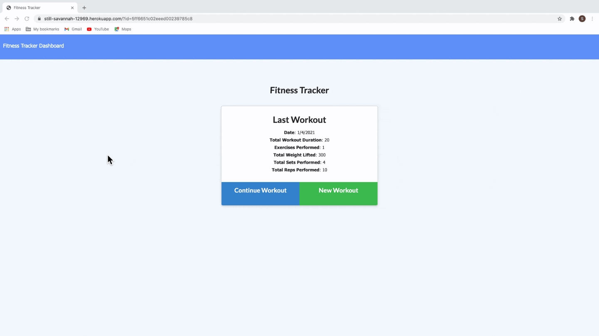

# Workout-Tracker

Workout-Tracker is an application  that lets users track workouts, add exercises, see stats by days. 

Checkout the [Deployed app here](https://still-savannah-12969.herokuapp.com/).

## Table of Contents
* [Installation](#installation)
* [Usage](#usage)
* [Technologies](#technologies)
* [Contributing](#contributing)
* [License](#license)
* [Questions](#questions)

## Installation

You don't need to install it, just simply go to this [Link](https://still-savannah-12969.herokuapp.com/) or, if your prefer, copy this link https://still-savannah-12969.herokuapp.com/ and paste in your browser.

## Usage

* Gif:

* Description:

As an user you are able to:

1. Add exercises to the most recent workout plan.

2. Add new exercises to a new workout plan.

3. View the combined weight of multiple exercises from the past seven workouts on the dashboard page.

4. View the total duration of each workout from the past seven workouts on the dashboard page.

## Technologies

This application utilizes `node.js`, `MongoDB Atlas`, `express`, `mongoose`, `morgan`, `Heroku`.

## Contributing

When contributing to this repository, please first discuss the change you wish to make via issue, email, or any other method with the owners of this repository before making a change.

### Steps for contributing
1. Fork it!
2. Create your feature branch: `git checkout -b my-new-feature`
3. Commit your changes: `git commit -am 'Add some feature'`
4. Push to the branch: `git push origin my-new-feature`
5. Submit a pull request.

## License

## Questions

If you have any questions or concerns, feel free to contact me via:

GitHub: [slugovoy](https://github.com/slugovoy)

Email: serg.lugovoy.81@gmail.com